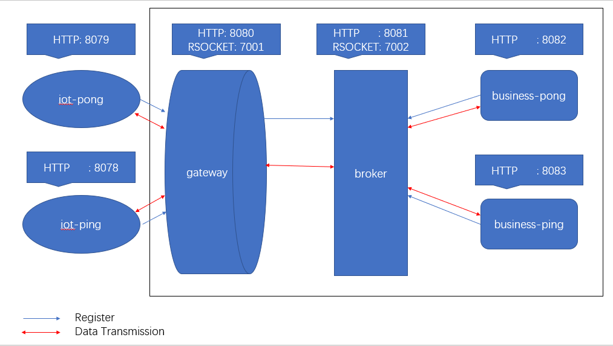
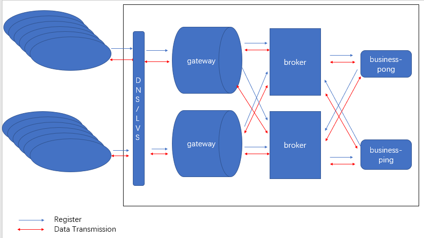
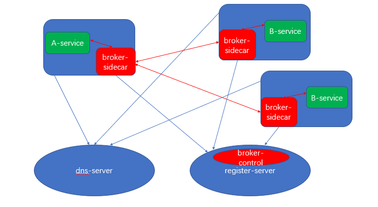

## Introduction
* I want use rsocket for iot, send business data from iot to server(business), or send control data from server(business) to iot 

## Architecture Diagram

* business-pong, business-ping, iot-pong, iot-ping are spring-cloud-rsocket-client
* broker, gateway are spring-cloud-rsocket-broker

## Operation
* Startup sequence: broker, gateway, business-pong, business-ping, iot-pong, iot-ping
* http://127.0.0.1:8078/ping?route=pong&destServiceName=business-pong-service-name&data=中文
    * iot-ping -> gateway stop
* http://127.0.0.1:8082/ping?route=pong&destServiceName=iot-ping-service-name&data=中文
    * business-pong -> broker -> gateway -> iot-ping

## Questions
* How to see what service instances are registered with the broker
* Gateway register to broker, only business can send data to iot, even though I set broker to register to gateway, only support One-way communication, Designed so or a bug?
* How can I use gateway to prevent iot-ping send data to iot-pong
* If use gateway has prevented iot-ping send data to iot-pong, there may appear iot-ping -> gateway -> broker -> gateway -> iot-pong
* Which api can i use for send data to IOT from business
* How long will I know IOT down when i send data from business
* The same question How long will I know business had Offline(May not be online again in the future) when i send data from IOT
* If gateway restart, how long will iot reconnect to gateway success
* If i have tens millions of iot device, should i use dns/lvs for reduce the number of connections per broker, just like the picture design below Or is there any better way?

* When files are frequently transferred between services, I think it may cause pressure on the broker. Is there any good solution?
* I think rsocket is good for data transmission, and service mesh is good for control, i want use rsocket broker like the picture design below

    * register-server
        * When service start broker-sidecar register self to register-server, and register-server have control rule for brokers communication rules
        * DNS is register-server backup, when register-server down broker can search service by DNS, also K8S headless can search all instance,This can be achieved if the service communication is not enforced
    * broker-sidecar
        * When service start broker-sidecar register self to register-server, and pull the rule from broker-control
        * If using lazy mode, broker-sidecar to connect to other broker-sidecar when service call, or immediately connect to other broker-sidecar by the rule form broker-control
        * broker-sidecar can implement load balancing, A/B Testing and and many more
    * service
        * Service only connect to broker-sidecar, This is similar to k8s service ip
        * When the service configures the wrong service name, the broker-sidecar can correct it
        
## Good website about rsocket
* http://rsocket.io
* http://rsocketbyexample.info
* https://docs.spring.io/spring-boot/docs/2.2.4.RELEASE/reference/htmlsingle/#boot-features-rsocket
* https://docs.spring.io/spring/docs/5.2.3.RELEASE/spring-framework-reference/web-reactive.html#rsocket
    * attention: https://docs.spring.io/spring/docs/5.2.3.RELEASE/spring-framework-reference/web-reactive.html#rsocket-metadata-extractor
* cli
    * https://github.com/rsocket/rsocket-cli
    * https://github.com/rsocket/rsocket-go/cmd/rsocket-cli
    * https://github.com/making/rsc
* broker
    * https://github.com/spring-cloud-incubator/spring-cloud-rsocket
    * https://repo.spring.io/libs-snapshot-local/org/springframework/cloud/spring-cloud-rsocket-dependencies/
    * 